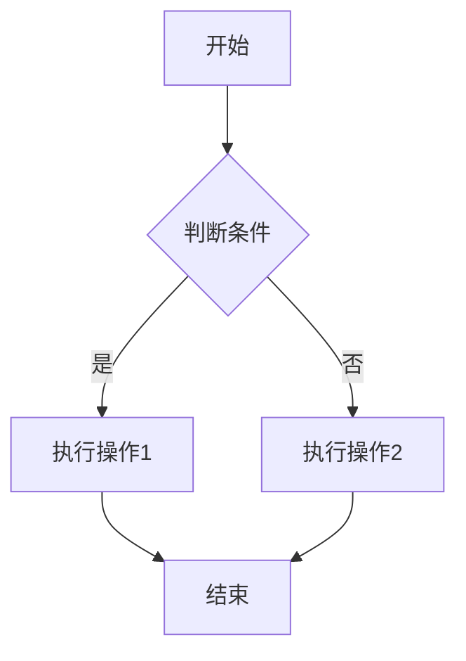

# SVG to PNG Converter Tool

一个简单易用的在线SVG转PNG工具,支持Mermaid图表和普通SVG文件的转换。

## 📁 项目结构

```
svg-to-png-converter/
├── index.html          # 主页面
├── README.md           # 项目说明文档
├── LICENSE             # MIT许可证
├── assets/
│   └── style.css       # 样式文件
└── js/
    └── converter.js    # 转换逻辑
```

## 🚀 快速开始

### 在线使用
访问 GitHub Pages 部署的在线版本：
`https://qingguang0309.github.io/svg-to-png-converter`

### 本地运行
1. 克隆仓库
```bash
git clone https://github.com/qingguang0309/svg-to-png-converter.git
cd svg-to-png-converter
```

2. 使用任意HTTP服务器运行
```bash
# 使用Python
python -m http.server 8000

# 或使用Node.js
npx serve
```

3. 在浏览器中打开 `http://localhost:8000`

## ✨ 功能特性

- ✅ 支持Mermaid代码实时渲染
- ✅ 支持SVG文件上传
- ✅ 高质量PNG导出（可调节分辨率）
- ✅ 响应式设计，支持移动端
- ✅ 无需后端，纯前端实现
- ✅ 支持深色/浅色主题

## 📖 使用说明

### 方式1：使用Mermaid代码
1. 在左侧文本框输入Mermaid代码
2. 点击"渲染图表"按钮
3. 预览生成的图表
4. 点击"导出PNG"下载图片

### 方式2：上传SVG文件
1. 点击"上传SVG文件"按钮
2. 选择本地SVG文件
3. 预览图表
4. 点击"导出PNG"下载图片

## 🛠️ 技术栈

- HTML5 / CSS3 / JavaScript
- [Mermaid.js](https://mermaid.js.org/) - 图表渲染
- [html2canvas](https://html2canvas.hertzen.com/) - Canvas转换
- 无需构建工具，开箱即用

## 📝 示例代码

### Flowchart示例


### Sequence Diagram示例


## 🤝 贡献指南

欢迎提交Issue和Pull Request！

1. Fork本仓库
2. 创建特性分支 (`git checkout -b feature/AmazingFeature`)
3. 提交更改 (`git commit -m 'Add some AmazingFeature'`)
4. 推送到分支 (`git push origin feature/AmazingFeature`)
5. 开启Pull Request

## 📄 许可证

本项目采用 MIT 许可证 - 查看 [LICENSE](LICENSE) 文件了解详情

## 🙏 致谢

- [Mermaid.js](https://mermaid.js.org/) - 强大的图表生成库
- [html2canvas](https://html2canvas.hertzen.com/) - HTML转Canvas工具

## 📮 联系方式

如有问题或建议，欢迎通过以下方式联系：
- 提交 [Issue](https://github.com/qingguang0309/svg-to-png-converter/issues)
- 发送邮件至：qingguang0309@163.com

## 🔄 更新日志

### v1.0.0 (2026-01-09)
- ✨ 初始版本发布
- ✅ 支持Mermaid图表渲染
- ✅ 支持SVG文件上传
- ✅ PNG导出功能

---

**Star ⭐ 本项目如果你觉得有用！**
